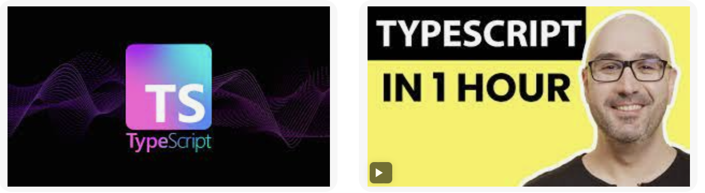

# mosh

 


### Tech stack

* [Typescript](https://www.typescriptlang.org) for front & back-end
* [Node.js](https://nodejs.org/en/) for the server environment(v18.12)
* NPM (8.19.2)


### Typescript setup:

```
npm i - g typescript || sudo npm i - g typescript
tsc -v

tsc
node dist/index.js

```

### What's covered:

```

Introduction
Prerequisites
How to Take This Course
What is TypeScript?
Setting Up the Development Environment 
Your First TypeScript Program
Configuring the TypeScript Compiler 
Debugging TypeScript Applications 
Fundamentals
Built-In Types
The any Type
Arrays
Tuples
Enums
Functions
Objects
Advanced Types
Type Aliases
Union Types 
Intersection Types 
Literal Types 
Nullable Types 
Optional Chaining

```